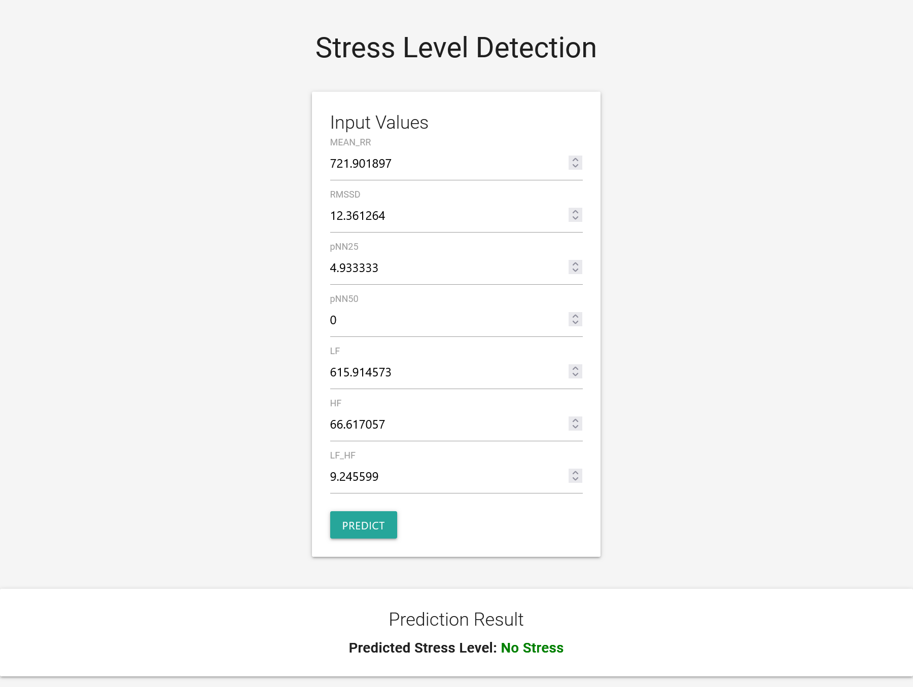

# Stress Level Detection

This project provides a Flask-based web application for detecting stress levels using machine learning. Users can input various physiological parameters to get a stress level prediction.



## Getting Started

There are two ways to use this project: training the model yourself using the provided Jupyter notebook, or using the pre-trained model via Docker.

### Option 1: Training the Model

1. Clone this repository:
   ```
   git clone https://github.com/pouryare/Stress-level-detection.git
   cd stress-level-detection
   ```

2. Download the dataset:
   - Visit [Heart Rate Prediction to Monitor Stress Level on Kaggle](https://www.kaggle.com/datasets/vinayakshanawad/heart-rate-prediction-to-monitor-stress-level)
   - Download the dataset files

3. Open and run the `Stress Level Detection.ipynb` notebook:
   - This notebook contains the code to train the model
   - Follow the instructions within the notebook to train and save the model

4. After training, ensure the following files are in your project directory:
   - `stress_detection_model.keras`
   - `scaler.joblib`

5. Install the required Python packages:
   ```
   pip install -r requirements.txt
   ```

6. Run the Flask application:
   ```
   python main.py
   ```

7. Open a web browser and navigate to `http://localhost:8080`

### Option 2: Using Docker

If you prefer to use the pre-trained model without going through the training process, you can use Docker:

1. Pull the Docker image:
   ```
   docker pull pouryare/stress-level-detection:latest
   ```

2. Run the Docker container:
   ```
   docker run -p 8080:8080 pouryare/stress-level-detection:latest
   ```

3. Open a web browser and navigate to `http://localhost:8080`

## Usage

Once the application is running:

1. You'll see input fields for various physiological parameters:
   - MEAN_RR
   - RMSSD
   - pNN25
   - pNN50
   - LF
   - HF
   - LF_HF

2. Enter values for each parameter and click "Predict"

3. The application will display the predicted stress level: No Stress, Low Stress, or High Stress

## Project Structure

- `main.py`: Main Flask application containing both the web server and model logic
- `requirements.txt`: List of Python dependencies
- `Dockerfile`: Instructions for building the Docker image
- `templates/index.html`: HTML template for the web interface
- `Stress Level Detection.ipynb`: Jupyter notebook for model training
- `stress_detection_model.keras`: Trained model file
- `scaler.joblib`: Scaler for normalizing input data

## Acknowledgements

This project was inspired by and builds upon the work of others in the field of stress detection using physiological signals. We acknowledge the contributions of the open-source community and the creators of the datasets and tools used in this project. Special thanks to Vinayak Shanawad for providing the dataset on Kaggle.

## Disclaimer

This project is for educational purposes only. While it aims to provide insights into stress levels based on physiological data, it should not be used as a substitute for professional medical advice, diagnosis, or treatment. Always consult with a qualified healthcare provider for any health-related concerns.
